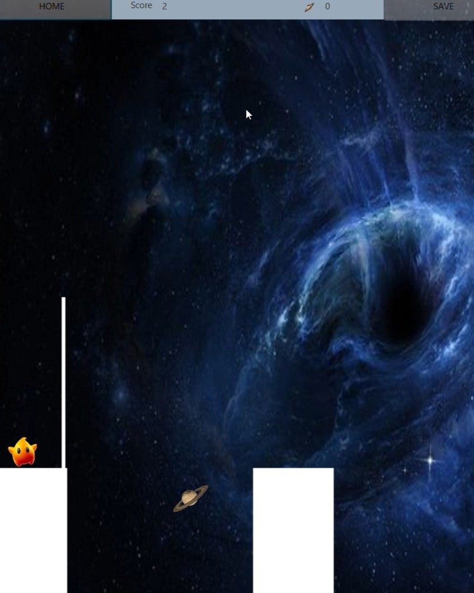

# Star Mystick
**Star Mystick** is a fun and interactive game where players guide a character across platforms by extending a bridge to connect the gaps between them. The game involves strategy, precision, and timing as the player adjusts the stick's length to match the gap size. Collect cherries to earn bonus points and achieve higher scores while avoiding a fall.

---
## Frames of Star Mystick

  
  
  

---
## Video Link

  

---

## Features

- **Dynamic Platforms**: Platforms are randomly generated with varying widths and distances.
- **Bridge Control**: Rotate and extend the stick to create a bridge for crossing gaps.
- **Score Tracking**: Scores are updated dynamically as the player progresses.
- **Cherry Collection**: Collect cherries for bonus points.
- **Game Over Screen**: Displays a popup when the player falls off a platform.

---

## Gameplay

1. Start the game and control the character on the starting platform.
2. Press the appropriate key to extend the stick.
3. Release the key to rotate the stick and form a bridge.
4. The stick must connect the starting and target platforms for the character to cross safely.
5. Collect cherries placed mid-gap for bonus points.
6. If the stick is too short or too long, the character will fall, and the game ends.

---

## Requirements

### Software
- **Java Development Kit (JDK)** 17 or higher.
- **JavaFX** 17 or higher.
- An IDE or text editor supporting JavaFX (e.g., IntelliJ IDEA, Eclipse).

### Hardware
- Any machine capable of running Java applications.

---

## Game Mechanics

### Platform Generation
&nbsp;&nbsp;&nbsp;&nbsp;The platforms are dynamically created using the PlatformFactory class. 
&nbsp;&nbsp;&nbsp;&nbsp;Each platform has random widths and distances, ensuring unique gameplay each time.

### Stick Mechanics
&nbsp;&nbsp;&nbsp;&nbsp;A bridge (stick) starts from the edge of the current platform. 
&nbsp;&nbsp;&nbsp;&nbsp;The length of the stick can be controlled by pressing and holding a key. 
&nbsp;&nbsp;&nbsp;&nbsp;When released, the stick rotates and extends to connect to the target platform.

### Cherry Collection
&nbsp;&nbsp;&nbsp;&nbsp;A cherry is randomly placed between platforms when the gap is wide enough. 
&nbsp;&nbsp;&nbsp;&nbsp;To collect a cherry, the character must cross the platform while the cherry is within reach.

### Scoring
&nbsp;&nbsp;&nbsp;&nbsp;1 Point: Successfully cross a platform.  
&nbsp;&nbsp;&nbsp;&nbsp;Bonus Points: Collect cherries for additional points.

### Game Over
&nbsp;&nbsp;&nbsp;&nbsp;The game ends if: 
&nbsp;&nbsp;&nbsp;&nbsp;The stick is too short to reach the target platform. 
&nbsp;&nbsp;&nbsp;&nbsp;The stick is too long and the character overshoots the platform. 

---

## Code Structure

### Main Classes
* MapController: Manages the platform creation, cherry placement, and game state transitions.
* MenuController: Handles the main menu and transitions to the game screen.
* PlatformFactory: Generates random platforms for the game.
* Player: Manages the player character's movements, interactions, and animations.
* ScoreKeeper: Tracks and displays the player's score and collected cherries.
* EndPopUp: Displays the "Game Over" popup and final score.
### Key Components
* Dynamic Animation: Leveraging JavaFX animations to create smooth transitions.
* Event Handling: Handles keyboard inputs for gameplay.
* AnchorPane: Serves as the game board, holding all UI components.

